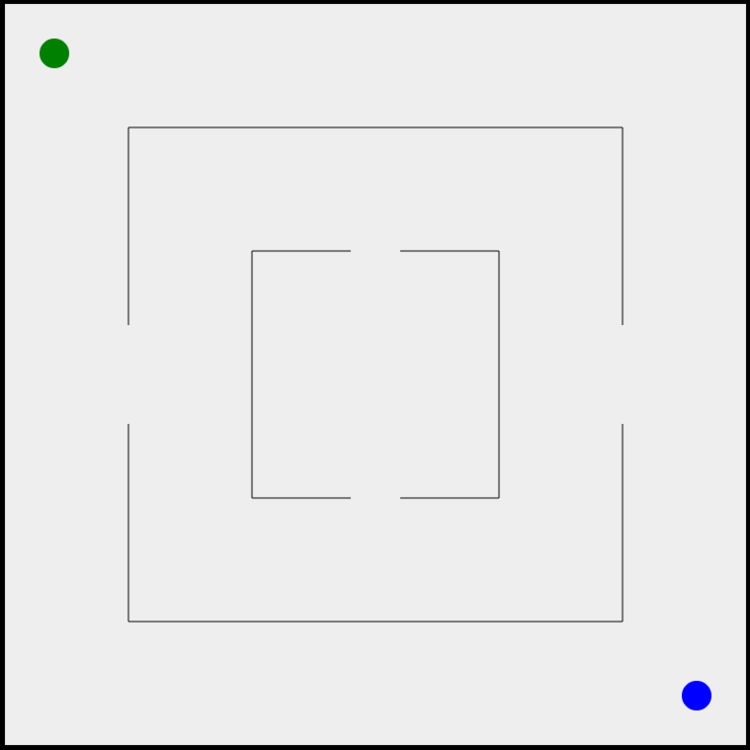

# Chaser
A two player game where there is a runner and a chaser. The runner has to try to run away from the chaser whilst the chaser has to try to catch the runner. The game is played in a field in which the chaser can hit the walls but the runner cannot.

## Aim of the Game
<b>Runner:</b> survive in the field without being caught for as long as possible  <b>Chaser:</b> catch the runner as soon as possible

## Content of the game
* 3 levels of increasing difficulty
* Options to change the color of the chaser and runner
* Option to change the difficulty
* Endless fun

## Levels

<b>Level 1</b> 
  
<b>Level 2</b> 
  
<b>Level 3</b> 
 

